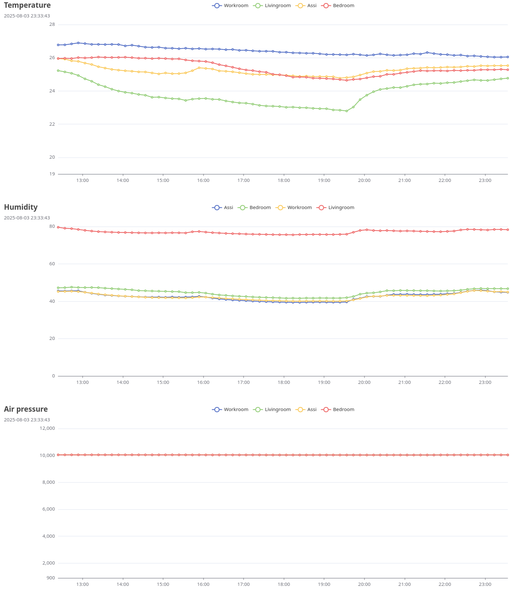

# Ruuvi graph

## Description

Ruuvi graph is an application for plotting temperature, humidity and air pressure based on Ruuvi tags measurements.
There are several similar apps but all seem to be doing too much.
Hence, this project was born.

Scanning happens passively by reading manufacturing info field from beacons Ruuvis are sending.
This drastically saves the battery life.
Downside is that events aren't equally distributed and seems to be proportional to sensor's distance.
Nevertheless, since tracking doesn't need to be in minute level this is okay.

An example graph which consists four sensors:


Charasteristics this application has:

* Single binary deployment
* Cross-compilation possible, hence compile on a different machine where it's being run
* No external service dependencies
  * No need to run time series database or MQTT etc.
* Avoids extensive writes to disk
  * Extremely important on Raspberry Pi and other machines which use micro SD cards

## Dependencies

* Go > 1.23 (maybe older are okay too)

## Build

Build a single executable binary for the given machine:

```bash
make build
```

See the list of supported operating systems and archs:

```bash
go tool dist list
```

Cross compile binary to some other architecture:

```bash
make GOARCH=arm build
```

## Configuration

Defaults should be sufficient for most usage cases and no further adjustments is needed.
Defaults can be examined with `./ruuvigraph -h` command.
Pay attention to filenames when examining the output.

Aliases file can be configured to map MAC addresses to user friendly names.
E.g. Ruuvitag with `aa:bb:cc:dd:ee:ff` MAC address is converted to `Kitchen`.
Copy an example aliases file from `pkg/ruuvi/example_devices.conf` to `cmd/ruuvi_aliases.conf` and
edit it to match your needs.

## Usage

Run server and client on the same host:

```bash
# Start server
./dist/ruuvigraph -s

# Start Bluetooth listener and streamer
doas ./dist/ruuvigraph
```

Doas or sudo is needed to interact with bluetooth device.
Better option would be to grant access to certain dedicated user only with e.g. bluetooth group access.

## Future plans

Lessons learned while doing this Sunday hack up and will be implemented for the version 2.0:

* Clean up code
* Hook up flags
* Add automatic clean up for measurements data (on the server side)
* Write results to disk for archiving purposes

